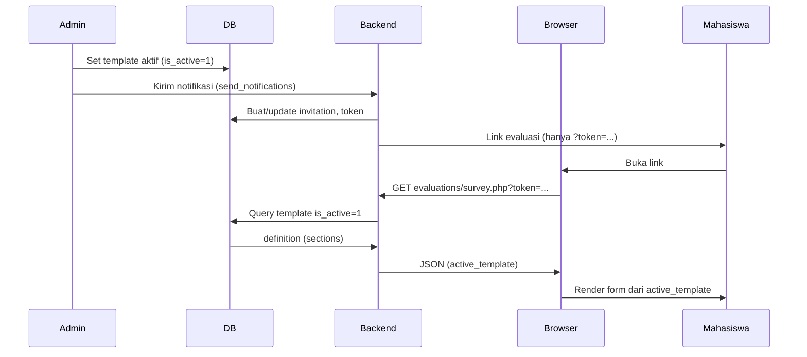

# Perbaikan: Form Evaluasi Lulusan Selalu Pakai Template Aktif Terbaru

## Alur saat ini (ringkas)

Link **tidak** menyimpan struktur form; hanya token. Struktur form diambil **setiap kali** mahasiswa membuka link, lewat `evaluations/survey.php` yang meng-query template `is_active = 1` (fallback `is_default = 1`). Kode di [backend/api/evaluations/survey.php](backend/api/evaluations/survey.php) (baris 69–86) sudah benar: query dijalankan per request, tidak ada snapshot template di invitation.

Penyebab paling mungkin form “lama” masih tampil: **response GET survey.php di-cache** (browser/proxy), sehingga mahasiswa dapat response lama yang berisi `active_template` versi sebelumnya.

## Perubahan yang akan dilakukan

### 1. Larang cache response survey.php (backend)

**File:** [backend/api/evaluations/survey.php](backend/api/evaluations/survey.php)

- Di awal script (setelah include CORS/database, sebelum `echo json_encode`), tambahkan header HTTP agar response **tidak pernah di-cache**:
  - `Cache-Control: no-store, no-cache, must-revalidate, max-age=0`
  - `Pragma: no-cache`
  - `Expires: 0`
- Dengan ini, setiap buka link evaluasi akan memukul server dan mendapat `active_template` terbaru dari DB.

### 2. Request survey tanpa cache (frontend, opsional tapi disarankan)

**File:** [src/lib/api-client.ts](src/lib/api-client.ts)

- Di `makeRequest`, untuk panggilan **GET** ke endpoint `evaluations/survey.php`, tambahkan opsi `cache: 'no-store'` pada `fetch(...)` agar browser tidak memakai cache untuk request ini.
- Alternatif: deteksi endpoint dari `endpoint === 'evaluations/survey.php'` (atau URL berisi `survey.php`) lalu set `cache: 'no-store'` hanya untuk itu, agar hanya survey yang no-store.

Dampak: meskipun server lupa mengirim no-cache, client tetap memaksa tidak pakai cache untuk halaman form evaluasi.

### 3. Validasi ringan dan fallback definition (backend, opsional)

**File:** [backend/api/evaluations/survey.php](backend/api/evaluations/survey.php)

- Setelah `json_decode` untuk kolom `definition`, pastikan struktur yang dikirim ke frontend selalu punya key `sections` (array). Jika `definition` null/korup, gunakan `['sections' => []]` agar frontend tidak error dan logika `useCustomForm` tetap jelas (false bila sections kosong).
- Tidak mengubah aturan bisnis: template aktif tetap satu (is_active=1, fallback is_default=1); hanya memastikan response konsisten.

## Yang tidak diubah

- **Tidak** menyimpan template_id atau definition di `evaluation_invitations` atau di link; link tetap hanya token.
- **Tidak** mengubah UI/UX halaman Form Evaluasi Lulusan; hanya memastikan sumber data (template aktif) selalu terbaru dan tidak di-cache.
- **Konsistensi data lama:** jawaban yang sudah tersimpan di `satisfaction_form_responses` tetap mengacu ke `template_id` saat submit; mengubah template aktif tidak mengubah data lama.

## Hasil yang diharapkan

- Admin mengganti template aktif di Kustom Formulir Kepuasan Pengguna → mengirim formulir evaluasi → mahasiswa membuka link (dashboard/email) → **formulir yang tampil mengikuti template aktif terbaru** (selalu diambil dari DB saat halaman dimuat, tanpa cache response lama).

## Pengecekan singkat setelah deploy

1. Set template A aktif, kirim evaluasi, buka link di jendela biasa → pastikan form sesuai template A.
2. Ganti template aktif ke B (tanpa refresh sistem/reset DB).
3. Buka lagi link yang sama (atau kirim link baru) → form harus sesuai template B.
4. Di DevTools → Network: request ke `evaluations/survey.php` seharusnya tidak memakai cache (status 200, bukan 304; response body berisi `active_template` dengan `definition.sections` sesuai template aktif saat ini).

